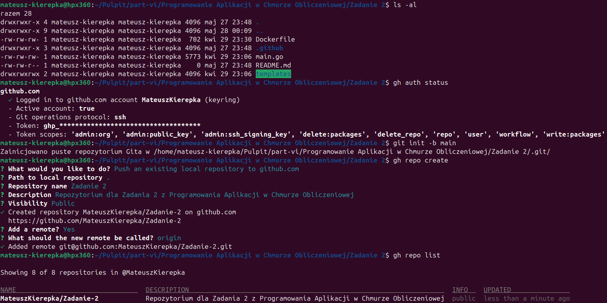
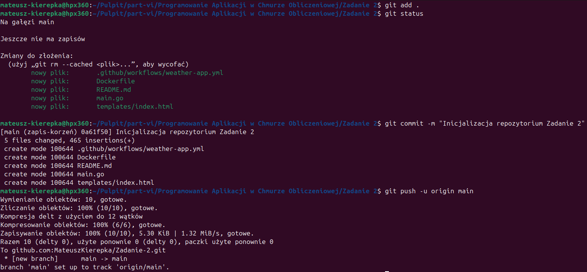
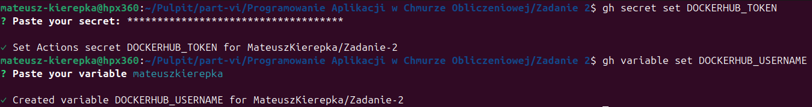
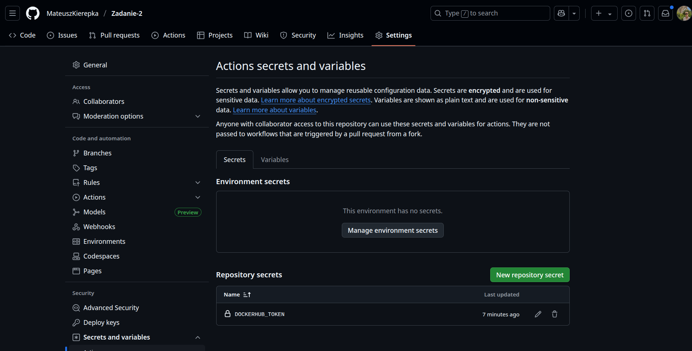
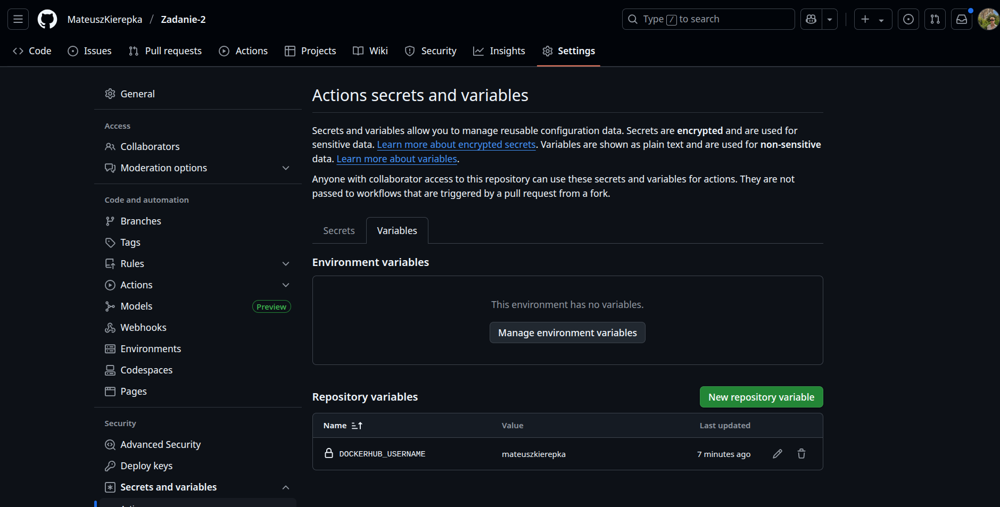
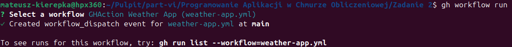
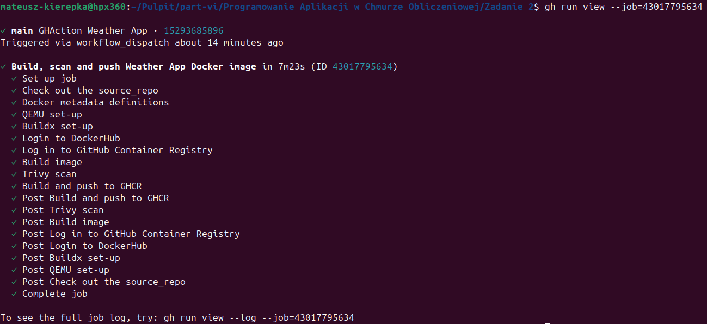
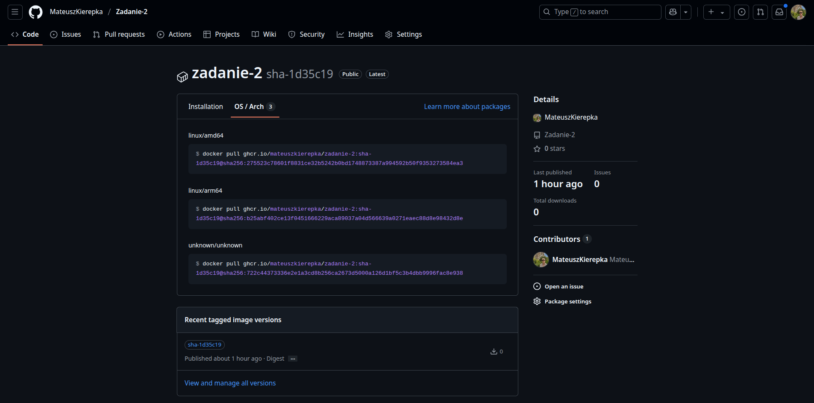
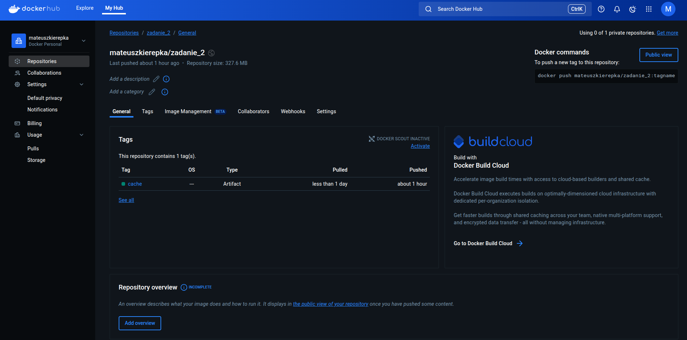

# Realizacja zadania 2. - część obowiązkowa

## Opis zadania

Repozytorium zawiera kompletny łańcuch (pipeline) w usłudze Github Actions, który:
- buduje obraz kontenera na podstawie Dockerfile'a oraz kodów źródłowych aplikacji opracowanej jako rozwiązanie zadania 1.
- wspiera dwie architektury: `linux/arm64` oraz `linux/amd64`
- wykorzystuje *dane cache* z eksporterem registry oraz backendem registry w trybie max (dane cache przechowywane w publicznym repozytorium DockerHub)
- wykonuje test podatności (CVE) obraz za pomocą skanera **Trivy** - push do ghcr.io następuje tylko wtedy, gdy nie wykryto podatności o poziomie "CRITICAL" lub "HIGH"
- wysyła gotowy obraz do publicznego repozytorium na Github (ghcr.io)

Opracowany łańcuch GHAction został uruchomiony.

## Etapy konfiguracji i wykonania zadania

### 1. **Inicjalizacja repozytorium**
- `git init -b main`
- `gh auth status`
- `gh repo create`
  

### 2. **Dodanie kodu, commit i push do Github**
- `git add .`
- `git commit -m "Inicjalizacja repozytorium zadanie 2"`
- `git push -u origin main`
  

### 3. **Konfiguracja sekretów i zmiennych repozytorium**
- `gh secret set DOCKERHUB_TOKEN`
- `gh variable set DOCKERHUB_USERNAME`
  

#### 3.1. **Potwierdzenie obecności sekretu i zmiennej w ustawieniach repozytorium**

### 4. **Uruchomienie workflow Github Actions**

#### 4.1. **Status wykonania wszyzstkich kroków**

### 5. **Potwierdzenie działania: multiarch, cache**

- **Obraz dostępny na GHCR** (zakładka Packages w repozytorium) – zawiera architektury `linux/amd64` oraz `linux/arm64`:

- **Cache**: Repozytorium `zadanie_2` na DockerHub zawiera tag `cache`:

## Opis konfiguracji workflow

Plik workflow został przygotowany w oparciu o oficjalne akcje GitHub oraz Docker:

- **Checkout kodu**: `actions/checkout`
- **Automatyczne tagowanie**: `docker/metadata-action`
- **Wsparcie multiarchitektury**: `docker/setup-qemu-action` oraz `docker/setup-buildx-action`
- **Buildx i cache**: `docker/build-push-action` z cache push/pull do DockerHub
- **Skan na podatności zagrożenia**: `aquasecurity/trivy-action` – obraz jest publikowany tylko, jeśli nie ma podatności HIGH/CRITICAL
- **Wysłanie obrazu**: do GHCR (`ghcr.io`)

## Przyjęty sposób tagowania obrazów i danych cache

**Obrazy Docker** tagowane są:
- Tag **SHA** - dla każdego commita
- Tag **semver** - przy pushu tagu w repozytorium, co pozwala na łatwą identyfikację wydań produkcyjnych

**Dane cache**:
- są przechowywane jako tag `cache` w publicznym repozytorium na DockerHub

## Test podatności CVE

Do testowania podatności CVE zostało wybrane narzędzie **Trivy**:
- Prosta integracja z Github Actions
- Pozwala automatycznie zatrzymać pipeline w razie wykrycia podatności CRITICAL lub HIGH (`exit-code: 1`)
